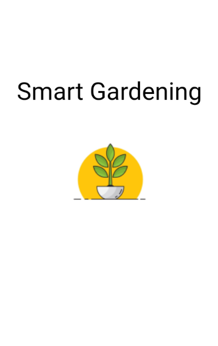
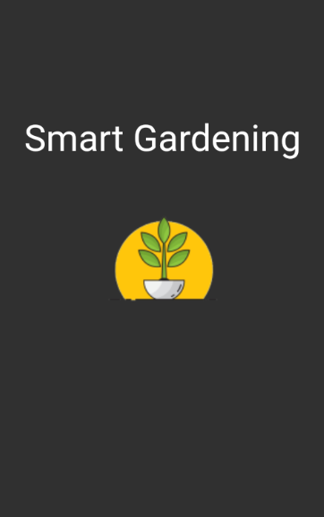
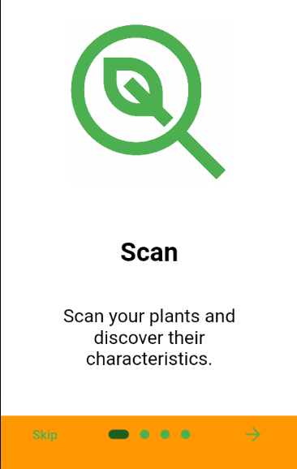
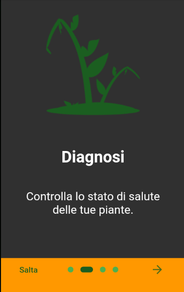
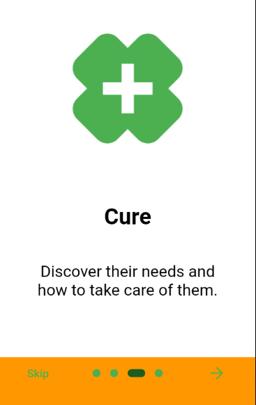

# SmartGardeningApp

An app for plant's care for a stage at the university _Alma Mater Studiorum_ of Bologna.

## Features
This app presents the following features:
- Plant recognition and retrieval of data from open.plantbook.io API.
- Plant's disease recognition.
- Possibility to save, check details and delete scanned plants in a database.
- Retrieve data from Netatmo Home Aircare sensor.
- Update in-app settings:
  - Theme
    - Light
    - Dark
  - Language
    - English
    - Italian
  - Enable | Disable Onboarding pages
  

## Screens
This are the screens of the app:

### Splash Screen
<!-- volendo ridurre il size delle immagini -->
 
<!--

 -->

### Onboarding
These are the welcome screens that show the user the features of the app.

   
<!--

 -->

### Homepage

### Navigation Drawer
 

### Scan Screen & Scan Result Screens
   

### My Plants & My Plants Details
This is the page where the scanned plants are stored.

     

### Diagnosis Screen
# SmartGardeningApp

An app for plant's care for a stage at the university _Alma Mater Studiorum_ of Bologna.

## Features
This app presents the following features:
- Plant recognition and retrieval of data from open.plantbook.io API.
- Plant's disease recognition.
- Possibility to save, check details and delete scanned plants in a database.
- Retrieve data from Netatmo Home Aircare sensor.
- Update in-app settings:
  - Theme
    - Light
    - Dark
  - Language
    - English
    - Italian
  - Enable | Disable Onboarding pages
  

## Screens
This are the screens of the app:

### Splash Screen
<!-- volendo ridurre il size delle immagini -->
 
<!--

 -->

### Onboarding
These are the welcome screens that show the user the features of the app.

   
<!--

 -->

### Homepage

### Navigation Drawer
 

### Scan Screen & Scan Result Screens
   

### My Plants & My Plants Details
This is the page where the scanned plants are stored.
     

### Diagnosis Screen
# SmartGardeningApp

An app for plant's care for a stage at the university _Alma Mater Studiorum_ of Bologna.

## Features
This app presents the following features:
- Plant recognition and retrieval of data from open.plantbook.io API.
- Plant's disease recognition.
- Possibility to save, check details and delete scanned plants in a database.
- Retrieve data from Netatmo Home Aircare sensor.
- Update in-app settings:
  - Theme
    - Light
    - Dark
  - Language
    - English
    - Italian
  - Enable | Disable Onboarding pages
  

## Screens
This are the screens of the app:

### Splash Screen
<!-- volendo ridurre il size delle immagini -->
 

### Onboarding
These are the welcome screens that show the user the features of the app.

   

### Homepage

### Navigation Drawer
 

### Scan Screen & Scan Result Screens
   

### My Plants & My Plants Details
This is the page where the scanned plants are stored.

     

### Diagnosis Screen

### My Sensor Screen
  

### Settings Screen
   

### Privacy Policy and Terms & Conditions
 

## Installation
- Install apk on Android
- Install .ipa on iOS

## Requirements
- Flutter 2.10.5

## User guide
If you want to modify the code, in order for the app to work:
- In the 'plant_api.dart' in the directory `/lib/api/plant_api/` to be able to connect to [OpenPlantBook](open.plantbook.io), you'll need to update:
  - clientId
  - clientSecret
- In the 'sensor_api.dart' in order to be able to connect to [Netatmo API](https://dev.netatmo.com/apidocumentation/oauth) you'll need to modify:
  - clientId
  - clientSecret
  - email
  - password
